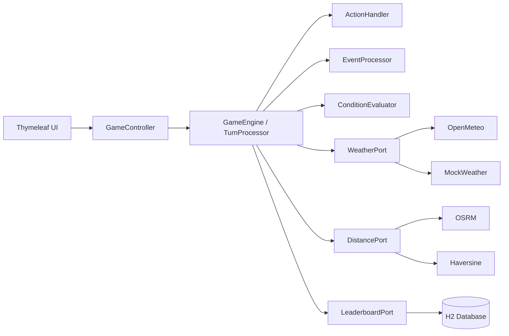

# Silicon Valley Trail

> [Design Document](docs/DESIGN.md) | [TODO](docs/TODO.md)

Turn-based survival game inspired by Oregon Trail, set in the startup world. Guide a team from San Jose to San
Francisco, managing resources, surviving events, and making decisions each turn.

Built with Java 21, Spring Boot, Thymeleaf, and H2.

---

## How to run

```bash
mvn spring-boot:run
```

Then open `http://localhost:8080`.

---

## Design Chart



---

## Stack

- **Backend:** Java 21 + Spring Boot
- **Frontend:** Thymeleaf (server-rendered HTML)
- **Database:** H2 (embedded, in-memory)
- **APIs:** Open-Meteo (weather), Haversine formula (distances)
- **Testing:** JUnit 5, Mockito, AssertJ

---

## Status

Work in progress. See [TODO](docs/TODO.md) for current progress.
