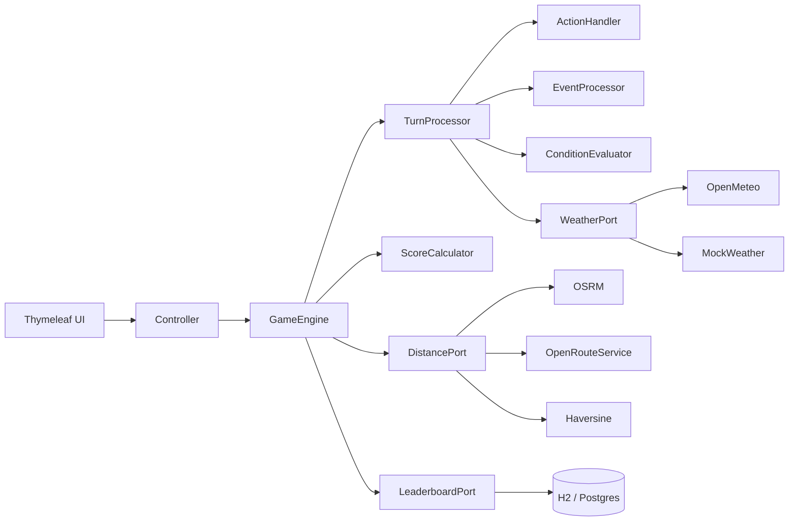

# Silicon Valley Trail

Turn-based survival game inspired by Oregon Trail. Guide a startup team from San Jose to San Francisco, managing resources, surviving events, and making decisions each turn.

**Live demo:** [silicon-valley-trail.duckdns.org](http://silicon-valley-trail.duckdns.org)

> [Design Document](docs/DESIGN.md) - architecture decisions, tradeoffs, and the "why" behind everything.

---

## Quick Start

**Prerequisites:** Java 21

Clone Repository
```
git clone https://github.com/paulofranklins/silicon-valley-trail.git
```

``` bash
cd silicon-valley-trail
./mvnw spring-boot:run
```

Open `http://localhost:8080`. That's it.

No database setup needed. No API keys needed. H2 runs in-memory by default, and all APIs used are free and keyless.

**Note:** Road and Walking+ modes use OSRM for real driving distances. OSRM's public server is free but can be slow or unreliable. If OSRM is down, the game falls back to straight-line distances and offers two options: keep retrying until OSRM responds, or play with estimated distances (ranked as the equivalent Fast mode for fair leaderboard scores). Setting up an `ORS_API_KEY` in a `.env` file (free at [openrouteservice.org](https://openrouteservice.org/dev/#/signup)) adds a reliable driving distance fallback before hitting straight-line estimates.

### Run tests

```bash
./mvnw test
```

74 tests across 15 test files covering domain logic, game mechanics, API adapters, and score calculation.

---

## API Keys & Mocks

No API keys are required. All 4 game modes work out of the box.

| API | What it does | Key needed |
|-----|-------------|------------|
| **Open-Meteo** | Real weather for each city | No |
| **OSRM** | Real driving distances (Road mode) | No |
| **OpenRouteService** | Driving distance fallback if OSRM is down | Optional (free tier) |
| **Haversine** | Straight-line distance (Fast mode) | No (pure math) |

**Weather mocks:** Change `game.weather.mode` in `application.yml`:
- `api` - real weather (default)
- `mock` - random weather
- `demo` - cycles through all weather types

**ORS key (optional):** If OSRM is unreliable, set `ORS_API_KEY` in a `.env` file. Get a free key at [openrouteservice.org](https://openrouteservice.org/dev/#/signup). See `.env.example` for format.

**Database:** H2 in-memory by default. To use Postgres, set `DB_URL`, `DB_USERNAME`, `DB_PASSWORD` in `.env`, or run `docker compose up -d` for a local Postgres instance.

---

## Architecture

Lightweight hexagonal architecture. Domain logic doesn't know about Spring, APIs, or the database.

```
domain/         game rules, state, enums, ports (interfaces)
application/    game engine, turn processing, action handling, scoring
infrastructure/ API adapters, database, web controller, data loader
```



**Ports** define what the game needs. **Adapters** implement how. Swapping an API is one file - no game logic changes.

### Dependencies

- Java 21, Spring Boot 3.4.4
- Thymeleaf (server-rendered HTML)
- H2 + PostgreSQL (via Spring Data JPA)
- Jackson + jackson-dataformat-yaml
- spring-dotenv
- Lombok
- JUnit 5, Mockito

---

## Game Modes

| Mode | Distance | Speed | Difficulty |
|------|----------|-------|------------|
| **Fast** | Straight-line (Haversine) | 5 km/turn | Easy |
| **Road** | Driving (OSRM/ORS) | 5 km/turn | Medium |
| **Walking** | Straight-line | 2 km/turn | Hard |
| **Walking+** | Driving (OSRM/ORS) | 2 km/turn | Hardest |

Distances are pre-computed at startup and cached. Road/Walking+ fall back to their straight-line equivalents if the routing API is not available, with a retry option for the player.

---

## Gameplay

**Actions per turn:** Travel, Rest, Scavenge, Hackathon, Pitch VCs. Each has tradeoffs - travel drains energy and food, rest costs food but recovers stats, scavenge is a gamble.

**6 stats:** Health, Energy, Morale, Cash, Food, Compute Credits. All matter - energy gates actions, food has a grace period death clock, cash is spent at city markets, compute affects travel distance.

**Events:** 20+ random events across 5 categories (weather, team, market, location, tech). 5 have player choices with real tradeoffs. 20% chance per turn.

**Markets:** Open the city market voluntarily. 5 market variants rotate randomly per city. Spend cash on food, energy, compute, or morale. Each option can only be bought once per city.

**Loss conditions:** Health = 0, Morale = 0, Food at 0 for 2 turns, Cash at 0 for 3 turns. Victory if you reach San Francisco - even with 0 health.

**Weather:** Real weather from Open-Meteo affects gameplay on travel turns only. Resting is "indoors" - prevents exploiting clear weather for free stats.

**Leaderboard:** Score calculated from victory bonus, turn efficiency, remaining stats, and resources. Separate rankings per game mode. Stored in H2 (or Postgres).

---

## Example Gameplay

```
Turn 1:  Select TRAVEL to move 5km toward Santa Clara, lose 15 energy, 1 food, 1 compute
         Weather: Clear to +2 health, +5 energy (travel only)

Turn 2:  Select TRAVEL to arrive at Santa Clara
         Event (20% chance): "Team Argument" to morale -15

Turn 3:  Open Market to "Food Truck Rally" to buy meals (-$25, +5 food)
         Select REST to +5 health, +10 energy, +10 morale, -1 food

Turn 4:  Energy too low for travel to REST forced
         Grace warning appears: "starving 1/2" (food at 0)

Turn 5:  Select SCAVENGE to -10 energy, found food (+2)
         Grace counter resets - crisis averted
```

---

## Design Notes

Full design document at [docs/DESIGN.md](docs/DESIGN.md). Covers:

- **Game loop & balance** - why 6 stats, why 20% event chance, why grace periods
- **API choices** - Open-Meteo (keyless, real data), OSRM + ORS (driving distances with fallback chain), Haversine (pure math, always works)
- **Data modeling** - YAML files for game content (events, actions, locations, markets), JPA entity for leaderboard
- **Error handling** - API fallbacks, input validation, graceful degradation
- **Tradeoffs** - 14 documented decisions with benefits and costs
- **"If I had more time"** - weighted event selection, Flyway migrations, integration tests

---

## AI Disclosure

- I used AI (Claude Code) as a research and discussion tool during development.

Mainly for looking up API documentation, bouncing ideas on tradeoffs, and getting a second opinion on edge cases.

- I also leveraged AI for frontend polish, CSS animations, visual effects, and UI consistency across pages.

Not every suggestion was accepted, several were rejected after evaluating the tradeoffs myself.  

All architecture decisions, design choices, and code are my own. 

- The game does not use AI at runtime.

---

## Project Structure

```
src/main/java/com/pcunha/svt/
├── domain/          models, enums, ports
├── application/     GameEngine, TurnProcessor, ActionHandler, EventProcessor,
│                    ConditionEvaluator, ScoreCalculator
└── infrastructure/  API adapters, database, web controller, YAML loader

src/main/resources/
├── data/            actions.yaml, events.yaml, locations.yaml, markets.yaml
├── static/          CSS (13 files), JS (6 files), images
└── templates/       start, game, end, leaderboard + fragments

src/test/java/       15 test files, 74 tests
```