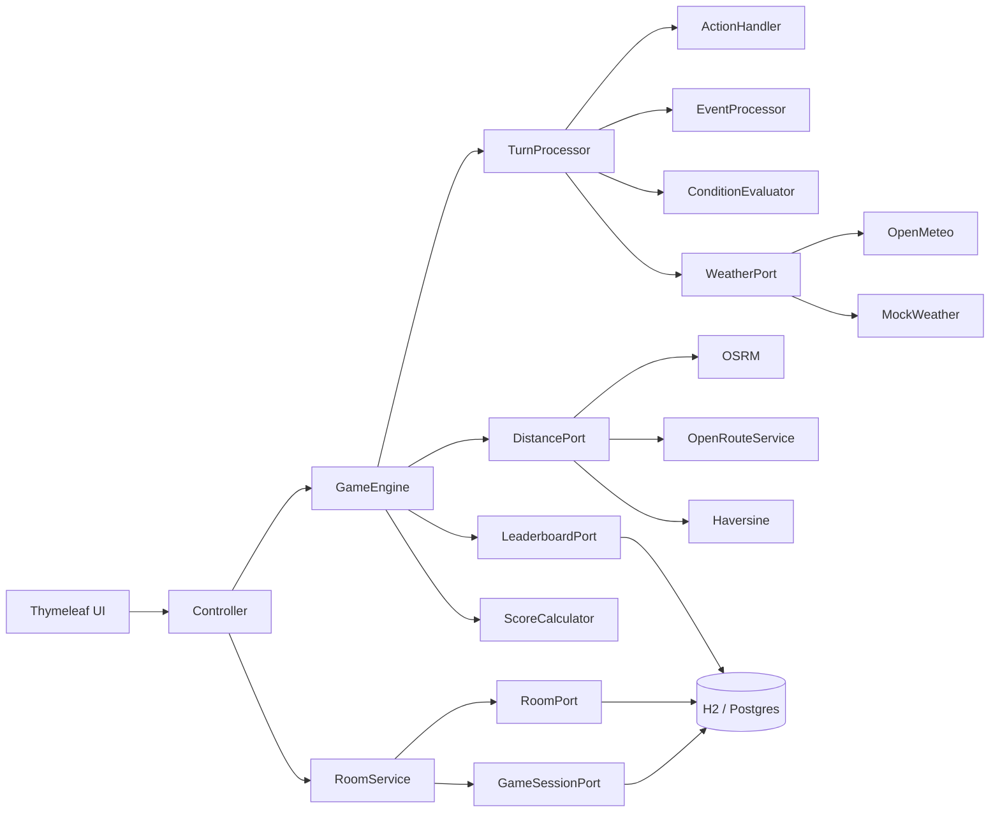

# Silicon Valley Trail

Turn-based survival game inspired by Oregon Trail. Guide a startup team from San Jose to San Francisco, managing resources, surviving events, and making decisions each turn.

**Live demo:** [silicon-valley-trail.duckdns.org](http://silicon-valley-trail.duckdns.org)

> [Design Document](docs/DESIGN.md) - architecture decisions, tradeoffs, and the "why" behind everything.

---

## Quick Start (from a fresh machine)

**The only thing you need to install is a JDK 21.** Everything else (Maven, dependencies, database, API access) is bundled or fetched automatically.

### 1. Install Java 21

Pick whichever works for your OS:

- **macOS** (Homebrew): `brew install --cask temurin@21`
- **Windows** (winget): `winget install EclipseAdoptium.Temurin.21.JDK`
- **Linux** (apt): `sudo apt install openjdk-21-jdk`
- **Anywhere**: download from [adoptium.net](https://adoptium.net/temurin/releases/?version=21)

Confirm it works:
```bash
java -version
```
You should see something like `openjdk version "21.0.x"`.

### 2. Clone the repo

```bash
git clone https://github.com/paulofranklins/silicon-valley-trail.git
cd silicon-valley-trail
```

### 3. Run the app

```bash
./mvnw spring-boot:run
```

### 4. Open the game

[http://localhost:8080](http://localhost:8080)

That's it. No database to install, no API keys to configure, no `.env` file required. H2 runs in-memory by default, all APIs are free and keyless.

### Stop the server

`Ctrl+C` in the terminal.

### Common issues

- **`./mvnw: Permission denied`** on macOS/Linux: run `chmod +x mvnw` once.
- **Port 8080 in use**: stop the other process, or run `./mvnw spring-boot:run -Dspring-boot.run.arguments=--server.port=8081` and open `localhost:8081`.
- **OSRM mode hangs or fails**: see the next section about API reliability.

### Optional: run with Postgres instead of H2

The default H2 in-memory database needs zero setup, so most reviewers should ignore this section. If you want to point the app at a real Postgres (the leaderboard then survives restarts), you have two paths.

**Option A: Docker Compose (recommended)**

The repo ships a `docker-compose.yml` that starts a Postgres 16 container, automatically creating a database called `svt` with user `root` / password `root`. Prerequisites: Docker Desktop or any Docker engine.

```bash
# 1. Start the Postgres container
docker compose up -d

# 2. Create a .env file at the project root follow .env.exemple tenplate

# 3. Run the app
./mvnw spring-boot:run
```

To verify the connection worked, look for `HikariPool` and `jdbc:postgresql` lines in the startup logs (instead of `jdbc:h2:mem`).

To stop and clean up:

```bash
docker compose down -v
```

**Option B: Bring your own Postgres**

If you already have a Postgres instance running locally or remotely, you need to do two things yourself first:

1. **Create the database.** The app does NOT create the Postgres database (only the tables inside it). Connect to your Postgres and run:
   ```sql
   CREATE DATABASE svt;
   ```
2. **Make sure the user has permission** to create tables in that database.

Then set the three env vars following .env.exemple

JPA's `ddl-auto: update` creates all the tables on first startup. No manual schema or migration step.

Switching back to H2 is just deleting `.env` (or unsetting the env vars) and restarting.

### No API keys required

This was a deliberate design goal from day one. Should be able to clone, run, and play without signing up for anything. Every API used is free and keyless:

- Open-Meteo for weather, no key
- OSRM public server for driving distances, no key
- Haversine for straight-line distances, pure math
- H2 in-memory database, no setup

**Heads up about OSRM:** the public OSRM server is free but it can be slow or fail outright (rate limits, public traffic spikes). Medium and Impossible modes use it. If OSRM is unreachable at startup, the game falls back to straight-line distances and downgrades the mode to its straight-line equivalent so the leaderboard stays fair. The player can also retry from the in-game modal.

If you hit a slow OSRM and want a smoother experience, you have two paths:

1. Use the live demo at [silicon-valley-trail.duckdns.org](http://silicon-valley-trail.duckdns.org). The cached distances on the server are already warm.
2. Drop a free `ORS_API_KEY` in `.env` (sign up at [openrouteservice.org](https://openrouteservice.org/dev/#/signup)). OpenRouteService is the second link in the fallback chain and is significantly more reliable than OSRM. See `.env.example` for the format.

Both are optional. Plain `./mvnw spring-boot:run` works on its own.

### Run tests

```bash
./mvnw test
```

89 tests across 16 test files covering domain logic, game mechanics, API adapters, score calculation, and leaderboard service.

---

## API Keys & Mocks

No API keys are required. All 4 game modes work out of the box.

| API | What it does | Key needed |
|-----|-------------|------------|
| **Open-Meteo** | Real weather for each city | No |
| **OSRM** | Real driving distances (Road mode) | No |
| **OpenRouteService** | Driving distance fallback if OSRM is down | Optional (free tier) |
| **Haversine** | Straight-line distance (Fast mode) | No (pure math) |

**Weather mocks:** Change `game.weather.mode` in `application.yml`:
- `api` - real weather (default)
- `mock` - random weather
- `demo` - cycles through all weather types

**ORS key (optional):** If OSRM is unreliable, set `ORS_API_KEY` in a `.env` file. Get a free key at [openrouteservice.org](https://openrouteservice.org/dev/#/signup). See `.env.example` for format.

**Database:** H2 in-memory by default. To use Postgres, set `DB_URL`, `DB_USERNAME`, `DB_PASSWORD` in `.env`, or run `docker compose up -d` for a local Postgres instance.

---

## Architecture

Lightweight hexagonal architecture. Domain logic doesn't know about Spring, APIs, or the database.

```
domain/         game rules, state, enums, ports (interfaces)
application/    game engine, turn processing, action handling, scoring
infrastructure/ API adapters, database, web controller, data loader
```



**Ports** define what the game needs. **Adapters** implement how. Swapping an API is one file - no game logic changes.

### Dependencies

- Java 21, Spring Boot 3.4.4
- Thymeleaf (server-rendered HTML)
- H2 + PostgreSQL (via Spring Data JPA)
- Jackson + jackson-dataformat-yaml
- spring-dotenv
- Lombok
- JUnit 5, Mockito

---

## Game Modes

| Mode | Distance source | Speed | Multiplier |
|------|----------------|-------|------------|
| **Easy** | Straight-line (Haversine) | 3 km/turn | x1.0 |
| **Medium** | Driving (OSRM/ORS) | 3 km/turn | x1.3 |
| **Hard** | Straight-line | 1.2 km/turn | x1.7 |
| **Impossible** | Driving (OSRM/ORS) | 1.2 km/turn | x2.2 |
| **Daily** | Easy distance + speed | 3 km/turn | x1.0 |

Distances are pre-computed at startup and cached. Medium and Impossible fall back to their straight-line equivalents if the routing API is not available, with a retry option for the player.

The score multiplier weights leaderboard scores so harder modes are worth picking. A great Impossible run can beat a great Easy run on the unified ranking. The curve is super-linear because death risk grows non-linearly with distance and pace.

**Daily** is a special mode. Every player who picks Daily today gets the same RNG seed (derived from the date), so events and scavenge rolls are identical across the daily competition. The daily leaderboard is its own bracket, separate from the all-time ranking.

---

## Extras

Spec required: 3 actions, 3 stats, 10 locations, events with choices, 1 public API. Built on top of that:

- 5 game modes instead of 1 (Easy, Medium, Hard, Impossible, Daily)
- 6 stats instead of 3, with grace-period death clocks for food and cash
- 15 locations instead of 10
- 3 distance APIs with a fallback chain (OSRM, OpenRouteService, Haversine) and an automatic mode downgrade when the player ends up on estimated distances
- Live weather biases the event pool, not just stat deltas
- 20+ events across 5 categories, 7 with player choices
- Daily mode with a deterministic seed per (mode, date) so all players today share the same run
- Cookie-based identity (`svt_player` UUID, 30-day persistence)
- Cross-device resume via `/resume/{token}` URL, exposed on the home page with click-to-copy
- Two leaderboard views (all-time top 10 weighted by mode multiplier, today's daily top 10), kept disjoint
- Optimistic locking on game sessions for two-tab and two-device safety
- Room and GameSession persistence layer that supports a future multiplayer extension as an additive change
- Server-side player name validation (10 char cap, non-blank, no double submit)
- Hexagonal architecture with ports in domain and adapters in infrastructure
- All game content in YAML (`actions.yml`, `events.yml`, `markets.yml`, `locations.yml`, `tunables.yml`, `scoring.yaml`)
- 89 tests across 16 files
- Postgres support alongside H2, with `docker-compose.yml` for one-command setup
- Live deployed demo at [silicon-valley-trail.duckdns.org](http://silicon-valley-trail.duckdns.org)

Full reasoning for each item is in [docs/DESIGN.md](docs/DESIGN.md).

---

## Gameplay

**Actions per turn:** Travel, Rest, Scavenge, Hackathon, Pitch VCs. Each has real tradeoffs. Travel drains energy, food, and a bit of compute, plus a 50/50 roll for losing 5 morale or 5 health (the road is unpredictable). Rest recovers health, energy, and morale at the cost of food and a turn. Scavenge takes a guaranteed energy and health cost, then rolls between finding food (clean) or finding cash and taking a small morale hit (dirty). Hackathon guarantees compute and energy cost, then rolls jackpot (+15 cash, +1 food) or wreck (-8 morale, -8 health). Pitch VCs is a gamble for cash, with a morale and health hit on a bad pitch.

**6 stats:** Health, Energy, Morale, Cash, Food, Compute Credits. All of them matter. Energy gates actions, food has a grace period death clock, cash is spent at city markets, compute affects travel distance, and health and morale are slow burners that you have to manage across the whole journey.

**Events:** 20+ events across 5 categories (weather, team, market, location, tech). 7 have player choices with real tradeoffs (Incoming Storm, Engineer Wants to Quit, VC Equity Offer, Conference Talk Slot, Abandoned Office, Technical Debt Crisis, Critical Production Bug). An event fires every time the team arrives at a new city. Content is drawn from the pool with a live weather bias. On rough weather (rainy, stormy, heatwave) the selection strongly prefers weather-themed events. On clear days it mostly pulls from the full pool but can still surface "Clear Skies" occasionally. That bias is the spec's "events conditional on API data" hook. The Open-Meteo signal materially shifts what the player encounters.

**Markets:** Open the city market voluntarily. 5 market variants rotate randomly per city. Spend cash on food, energy, compute, or morale. Each option can only be bought once per city.

**Loss conditions:** Health = 0, Morale = 0, Food at 0 for 2 turns, Cash at 0 for 3 turns. Victory if you reach San Francisco - even with 0 health.

**Weather:** Real weather from Open-Meteo affects gameplay on travel turns only. Resting is "indoors" - prevents exploiting clear weather for free stats.

**Leaderboard:** Score is calculated from victory bonus, turn efficiency, remaining stats, and resources, then multiplied by the mode's score multiplier so harder modes compete fairly with easier ones. Two views sharing one template:

- `/leaderboard` shows the all-time top 10 across all modes (excluding daily runs).
- `/leaderboard/daily` shows today's top 10 from the daily challenge.

Each row shows player, mode badge, outcome (Won / Bankrupt / Starved / Collapsed / Morale Broke), the city the team ended at, turns, raw score, multiplier, and final weighted score. Filler rows pad each table to 10 slots so the layout does not shift when the first real score lands. Player names are capped at 10 characters, validated server-side. Scoring weights live in `scoring.yaml` and the entity stores the raw inputs, so the formula can be retuned without wiping history. Stored in H2 by default, Postgres optional.

**Resume across sessions and devices:** every player gets a `svt_player` cookie (a random UUID) the first time they visit. The cookie persists for 30 days, so closing the browser and coming back the next day picks up exactly where you left off. The start page shows a "Continue run" button next to Launch when an active game exists. For cross-device resume (laptop to phone) the start page exposes a `/resume/<token>` URL inside a collapsible "Resume on another device" section. Open that URL on any other browser and it drops you straight into the game. No accounts, no email, no PII. The cookie is the identity.

---

## Example Gameplay

```
Turn 1:  Select TRAVEL to move 3km toward Santa Clara, lose 10 energy, 1 food, 2 compute
         Random roll: health -5 (rough patch on the road)
         Weather: Clear, +2 health, +5 energy (travel only)

Turn 2:  Select TRAVEL again, arrive at Santa Clara
         Random roll: morale -5
         Arrival event (weather is rainy, weather pool biased): Fog Delay, energy -5, food -1, morale -3

Turn 3:  Open Market: Food Truck Rally, buy meals (-$25, +5 food)
         Select REST: +8 health, +15 energy, +8 morale, -1 food

Turn 4:  Select HACKATHON, lose 12 energy and 1 food, gain 15 compute
         Random roll: jackpot, cash +15 and food +1

Turn 5:  Select SCAVENGE: -10 energy, -3 health, found food (+3)

Turn 6:  Select TRAVEL again, lose 10 energy, 1 food, 2 compute
         Random roll: health -5
```

---

## Design Notes

Full design document at [docs/DESIGN.md](docs/DESIGN.md). Covers:

- **Game loop & balance** - why 6 stats, why 20% event chance, why grace periods
- **API choices** - Open-Meteo (keyless, real data), OSRM + ORS (driving distances with fallback chain), Haversine (pure math, always works)
- **Data modeling** - YAML files for game content (events, actions, locations, markets), JPA entity for leaderboard
- **Error handling** - API fallbacks, input validation, graceful degradation
- **Tradeoffs** - 30+ documented decisions with benefits and costs
- **"If I had more time"** - integration tests for the persistence layer, weighted event selection, Flyway migrations, real multiplayer rooms (the Room/GameSession model already supports it)

---

## AI Disclosure

- I used AI (Claude Code) as a research and discussion tool during development.

Mainly for looking up API documentation, bouncing ideas on tradeoffs, and getting a second opinion on edge cases.

- I also leveraged AI for frontend polish, CSS animations, visual effects, and UI consistency across pages.

Not every suggestion was accepted, several were rejected after evaluating the tradeoffs myself.  

All architecture decisions, design choices, and code are my own. 

- The game does not use AI at runtime.

---

## Project Structure

```
src/main/java/com/pcunha/svt/
├── domain/          models, enums, ports (RoomPort, GameSessionPort, LeaderboardPort,
│                    WeatherPort, DistancePort)
├── application/     GameEngine, TurnProcessor, ActionHandler, EventProcessor,
│                    ConditionEvaluator, ScoreCalculator, LeaderboardService, RoomService
└── infrastructure/
    ├── api/         OpenMeteo, OSRM, OpenRouteService, Haversine, Mock/Demo adapters
    ├── data/        GameDataLoader (YAML deserialization)
    ├── persistence/ LeaderboardRepository, RoomRepository, RoomAdapter,
    │                GameSessionRepository, GameSessionAdapter
    └── web/         GameMvcController, GameRestController, PlayerCookies,
                     GameConfig, GlobalExceptionHandler

src/main/resources/
├── data/            actions.yaml, events.yaml, locations.yaml, markets.yaml,
│                    tunables.yaml, scoring.yaml
├── static/          css, js, img
└── templates/       start, game, end, leaderboard + fragments

src/test/java/       16 test files, 89 tests
```
